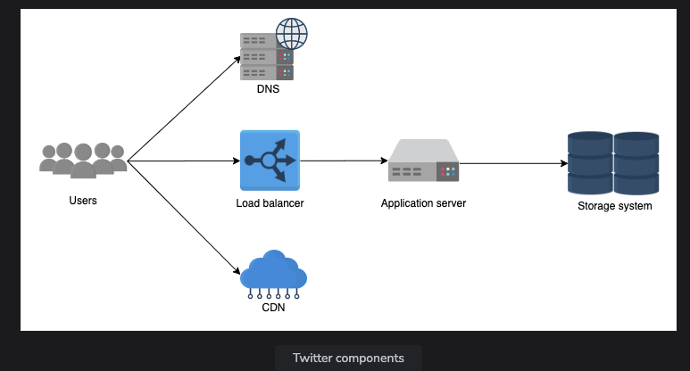

Twitter Defination

We will disscuss Top k Problem, tweets viewed and liked by millions of user on platform.

And finally i will explain how twitter performs load balancing for it's microservicde system to manage bllions of request between the various service instance.

Functional Requirements:
Registered users have the ability to post and delete multiple Tweets on Twitter.
Users can like, dislike, and reply to Tweets.
Users can search for Tweets using keywords, hashtags, or usernames.
Users can follow or unfollow other users.
Users can view timelines, including their own home timeline, featuring Tweets from those they follow, or view other users' timelines.

Non-Functional Requirements:
Twitter must ensure its service is highly available.
The distribution of Tweets to followers must have low latency.
Given the read-heavy workload with a read-to-write ratio of approximately 1000:1, Twitter requires high storage capacity to store and deliver Tweets from public figures to millions of followers.
Twitter must be highly reliable, ensuring no uploaded content is deleted or damaged.
An effective technique is essential to provide rapid feedback first to the user who liked a post, then to other users in the same region, and finally to all worldwide users associated with the Tweet.

Building BLocks we going to use:
Sequencers generate the unique IDs for the Tweets.
 sharded counter: help to handle the count of multiple features, such as viewing, liking, Retweeting, and so on, of the accounts with millions of followers.

Extended requirements
Metrics and analytics.

Estimation and Constraints
Let’s start with the estimation and constraints.

Note: Make sure to check any scale or traffic-related assumptions with your interviewer.

Traffic
This will be a read-heavy system, let us assume we have 1 billion total users with 200 million daily active users (DAU), and on average each user tweets 5 times a day. This gives us 1 billion tweets per day.

Tweets can also contain media such as images, or videos. We can assume that 10 percent of tweets are media files shared by the users, which gives us additional 100 million files we would need to store.

What would be Requests Per Second (RPS) for our system?

1 billion requests per day translate into 12K requests per second.

Storage
If we assume each message on average is 100 bytes, we will require about 100 GB of database storage every day.

We also know that around 10 percent of our daily messages (100 million) are media files per our requirements. If we assume each file is 50 KB on average, we will require 5 TB of storage every day.

And for 10 years, we will require about 19 PB of storage.

Bandwidth
As our system is handling 5.1 TB of ingress every day, we will a require minimum bandwidth of around 60 MB per second.

High-level estimate
Here is our high-level estimate:

| Type | Estimate |
| Daily active users (DAU) | 100 million |
| Requests per second (RPS) | 12K/s |
| Storage (per day) | ~5.1 TB |
| Storage (10 years) | ~19 PB |
| Bandwidth | ~60 MB/s |

DNS
LoadBalancers
Blog-Storage
key-value storage
pub-sub
A cache
A CDN
Monitoring

Explain All the componets, one liner statement..

Storage System:
> Google Cloud 

TOP K Problem:

